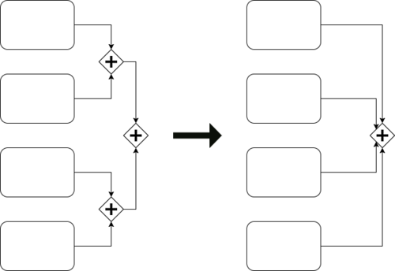
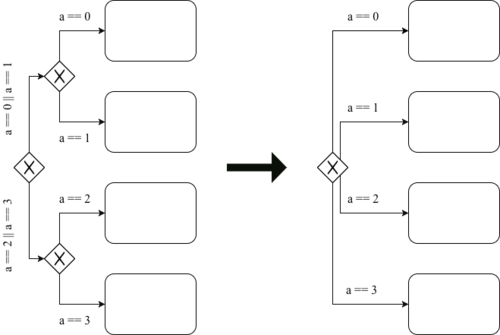
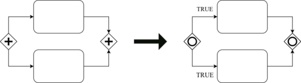
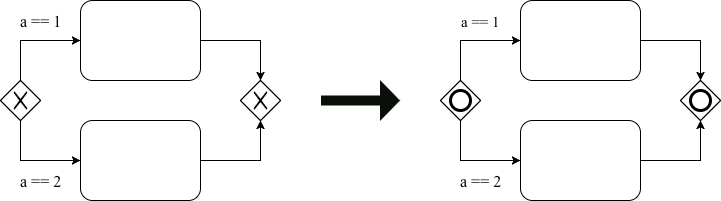
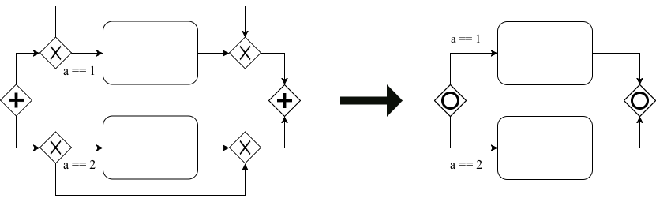
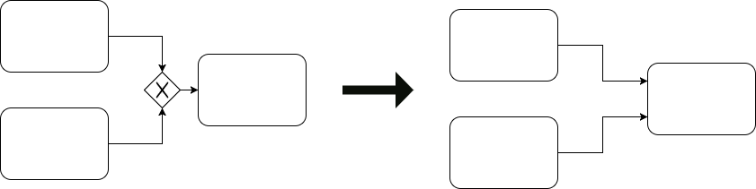
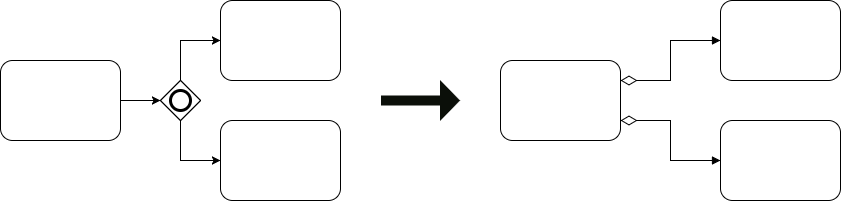

<!---I diagrammi su come funzionano YPNR NRNP eccetera, includili nel readme del programma.-->
<!---Ricordati di dire da qualche parte che i tuoi modelli sono compatiibli con Camunda e Signavio-->
<!---spiega come fare per creare una nuova regola. Non è complicato, si tratta di modificare 2 o 3 classi al massimo e poche righe di codice.-->

[](https://www.usi.ch/)


# Tool for semantics-preserving BPMN transformations

* This program will create semantically equivalent version of BPMN2.0 Models that are given as input
* The user can select which rules to apply among 8 different semantically equivalent transformations
* Reverse versions of the transformation rules are also available.

- - - -

## Introduction

This project was created in the scope of my master thesis at [Università della Svizzera italiana](https://www.usi.ch/en), in partial fulfillment of the requirements for the degree of [MSc in Management & Informatics](https://www.usi.ch/en/mmi)
Both the thesis and the project were supervised by <!---do you want to have your names in the readme or you prefer not to be mentioned?-->
**You will find the pdf of the thesis in the folder..**

## The transformation rules

### Rule1


*rule1*
<!---Descrizione-->

### Rule2


*rule2*
<!---Descrizione-->

### Rule3


*rule3a*
<!---Descrizione-->


*rule3b*
<!---Descrizione-->


*rule3c*
<!---Descrizione-->

### Rule4


*rule4a*
<!---Descrizione-->


*rule4b*
<!---Descrizione-->


*rule4c*
<!---Descrizione-->
- - - -

## Getting Started

#### Prerequisites

* Before running the program you need to install JAVA 1.8:

```
TODO installing java 1.8 from terminal
```

* Obtain a valid app id from Wolfram Alpha *

Wolfram alpha app IDs can be obtained by registering [here](https://account.wolfram.com/auth/sign-in). When you have an account go [here](http://developer.wolframalpha.com/portal/myapps/) and click on the upper right corner on "get an AppID", choose a name and a description for your app and click on "get an AppID"; then copy the ID that is generated.
Create a file called "WAappid.txt" in the BPMNTransformations folder.
Now paste your newly obtained wolfram alpha appID inside WAappid.txt.
*If you skip this step reversing Rule3b will not be possible, but the rest of the software should work normally*

### Running the program

* Open the terminal.
* Navigate to the \src\ folder

* Compile the program using the following command:
```
javac *.java
```
* Now execute the program using the following command:
```
java Main
```

- - - -

## Using the program

The software is managed through console commands that are composed of 3 parts:
* In the first part the user selects the input file(s)
* In the middle part the user selects the behavior of the program
* In the final part the user selects the transformation rule(s) to apply.

#### Selecting the input models:
In the first part simply enter the path of the folder containing the files that you want to transform: all '.bpmn' and '.bpmn.xml' files will be taken as input.

```
\Example\bpmnModels\
```
It is also possible to enter the path of a single file:
```
\Example\bpmnModels\Model.bpmn.xml
```

#### Selecting the program behavior:
For the second part the user has the choice of turning on/off two behaviors:
* Repetition (i.e. the program will try to apply the same transformations multiple times on the same model until it yelds no results)
* Permutations (i.e. the program will apply the rules you have chose in different orders, not just in the provided order).

To turn on the desired behavior, you have the choice among 4 combinations:

* **YPYR** or **YRYP** (i.e. Yes Perm Yes Rec)
* **NPNR** or **NRNP** (i.e. No Perm No Rec)
* **YPNR** or **NRYP** (i.e. Yes Perm No Rec)
* **NPYR** or **YRNP** (i.e. No Perm Yes Rec)

Now our input line looks something like this:

```
\Example\bpmnModels\ YPNR
```

#### Selecting the permutation rules:

Finally, we select the rules that will be applied from this list:
* Note that rules 3 and 4 can be divided in 3 different transformations: a, b and c and it is possible to choose exactly which ones to apply independently.
* Note that it is not suggested <!---nor possible ---> to apply a rule and the reverse version of the same rule.


Rule | Reversed rule:
---- | -------------
-1   | -r1
-2   | -r2
-3   | -r3
-3a  | -r3a
-3b  | -r3b
-3c  | -r3c
-4   | -r4
-4a  | -r4a
-4b  | -r4b
-4c  | -r4c

**Some rules <!---insert appropriate rules--> accept an optional input parameter <!---explain what it does-->. It can be added to rules by adding an asterisk followed by the desired number. The default value is 2.**

### Example inputs:
Some example inputs to get you started:

```
\Example\bpmnModels\Model.bpmn.xml NPNR (-1-2-3)
```

```
\Example\bpmnModels\ YPYR (-1-2-r3*2)
```

```
\Example\bpmnModels\ yryp (-R3*2-2)
```

```
\Example\bpmnModels\ yrnp (-3 -4a -4b)
```

**You can also write 'help' in the console to display a list of example inputs.**

### Expected Outputs

A new folder called 'output' will be created inside the input folder, 
<!---Far vedere sia i cambiamenti nei modelli, che il comportamento della console, che il report-->


## Extending the program

### Adding new rules

There's an empty Rule 5 method already present in the program, that can be filled with the desired transformations without needing to change the program further.
*However, the procedure to add a new rule is as follows:*
Create a .java class inside the 'src' folder (e.g. Rule5.java). Inside create a new static void apply(Model model). Inside that method write all the desired transformations using the methods of the classes Model.java and TravelAgency.java.

Then choose a parameter name for the new rule, e.g. "5" and add it to the list of valid parameter, which is a field of the class Parameter.java.
Transformation.java decides which Rule to apply to a Model depending on which Parameter the user provided, so inside the method applyRule() of Transformation.java a new "if block" has to be added that looks like this, where instead of ""5"" and "Rule5" the previously chosen parameter name and class name have to be put.

```
if (parameter.rule.equals("5")){
            Rule5.apply(resultingModel);
        }    
``` 


Then, optionally, the "printHelp()" method inside Main.java can also be updated to display the new parameter in the list of possible parameters.


### Adding compatibility with new editors (other than Camunda and Signavio)

When a new Model is created, the method findOutTagStyle() extrapolates the tag style from the start element's tag: first it looks for a start model tag in the written in Camunda's Style ("bpmn:startEvent"), then it looks for a start model tag written in Signavio's style ("startEvent").
Depending on which elements it finds, the field private String tagStyle of the Model.java class stores the style of the model information.

An alternative would be using the attribute "exporter" of the <bpmn:definitions> element of the XML, which explicitly states which exporter has been used to create the program (e.g. "Camunda Modeler") but using the start element instead allows the program to work even with models that are not exported with Camunda or Signavio but that might use the same style as one of the two.

To add a new tag style the attribute "exporter" might be used to distinguish the exporter explicitly, or depending on which element's tag is written in the peculiar style that element could be used; if it is an element that, unlike the start element, is not always present in a model the new style would be used only in cases where that element is present, otherwise another style could be used (and it would work correctly because the elements that are present would be written in the same way, otherwise they themselves could be used to distinguish the style).

```
        private String findOutTagStyle () {

        Element camunda = 
         (Element) doc.getElementsByTagName("bpmn:startEvent").item(0);
        Element signavio =
         (Element) doc.getElementsByTagName("startEvent").item(0);

        if (camunda != null) {
            //This model uses the camunda style for the tag names
            return "camunda";
        } else if (signavio != null) {
            //This model uses the signavio style for the tag names.
            return "signavio";
        } else {
            System.err.println("THIS SOFTWARE ONLY SUPPORTS MODELS CREATED " + 
            "WITH CAMUNDA OR SIGNAVIO");
            System.err.println("The model " + this.name + " appears to be " + 
            "written in a different style.");
            System.err.println("Either that, or it is missing the start " +
             "element.");
        }
        return "";
    }
```


After recognizing the tag style of the Model, every time the program searches for a certain element using an XML tag, or it creates a new element in the XML it has to first "translate" the tag to be the correct one. The translation is different depending on the type of the element for example "bpmndi" elements need not to be translated, while children of the process elements need "bpmn:" to be added as an appendix. The first "if" identifies the type of tagname, then secondly the appropriate modification is applied depending on the style of the model (saved in the \texttt{tagName} field of Model.Java). Editing this method to accept a third language is a matter of adding an "if" in the correct place and the applying the desired modification to the original string.

```
    String style (String tagName) {
    
        if (tagName.contains("bpmndi")) {
        // BPMNDI elements have the same tagnames in both camunda and
        // signavio so no need to change anything there
            return tagName;
        } else if (tagName.equals("Bounds")) {
            if (tagStyle.equals("camunda")) {
                return "dc:" + tagName;
            }
            if (tagStyle.equals("signavio")) {
                return "omgdc:" + tagName;
            }
        } else if (tagName.equals("waypoint")) {
            if (tagStyle.equals("camunda")) {
                return "di:" + tagName;
            }
            if (tagStyle.equals("signavio")) {
                return "omgdi:" + tagName;
            }
        } else {
            switch (tagStyle) {
                case "camunda":
                    return "bpmn:" + tagName;

                case "signavio":
                    return tagName;
                default:
                    //this is impossible but let's use signavio style
                    return tagName;
            }
        }
        return tagName;
    }
```

<!-- 
## Built With Libraries:

* [Camunda](www.google.com) - The API that...
* [Xpath](www.google.com) - The tool that.. -->


<!-- ## Author

* [**Ruben**](https://github.com/realityhas)

## Supervised by

* [**A**](www.google.com)
* [**C**](www.google.com) -->

## License

todo?