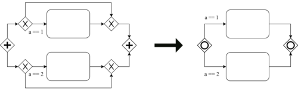

<!---I diagrammi su come funzionano YPNR NRNP eccetera, includili nel readme del programma.-->
<!---Ricordati di dire da qualche parte che i tuoi modelli sono compatiibli con Camunda e Signavio-->
<!---spiega come fare per creare una nuova regola. Non è complicato, si tratta di modificare 2 o 3 classi al massimo e poche righe di codice.-->

[](https://www.usi.ch/)


# Tool for semantics-preserving BPMN transformations

* This program will create semantically equivalent version of BPMN2.0 Models that are given as input
* The user can select which rules to apply among 8 different semantically equivalent transformations
* Reverse versions of the transformation rules are also available.

- - - -

## Introduction

This project was created in the scope of my master thesis at [Università della Svizzera italiana](https://www.usi.ch/en), in partial fulfillment of the requirements for the degree of [MSc in Management & Informatics](https://www.usi.ch/en/mmi)
Both the thesis and the project were supervised by <!---do you want to have your names in the readme or you prefer not to be mentioned?-->
**You will find the pdf of the thesis in the folder..**

## The transformation rules

### Rule1


*rule1*
<!---Descrizione-->

### Rule2


*rule2*
<!---Descrizione-->

### Rule3


*rule3a*
<!---Descrizione-->


*rule3b*
<!---Descrizione-->


*rule3c*
<!---Descrizione-->

### Rule4


*rule4a*
<!---Descrizione-->


*rule4b*
<!---Descrizione-->


*rule4c*
<!---Descrizione-->
- - - -

## Getting Started

#### Prerequisites

* Before running the program you need to install JAVA 1.8:

```
TODO installing java 1.8 from terminal
```

### Running the program

* Open the terminal.
* Navigate to the \src\ folder

* Compile the program using the following command:
```
javac *.java
```
* Now execute the program using the following command:
```
java Main
```

- - - -

## Using the program

The software is managed through console commands that are composed of 3 parts:
* In the first part the user selects the input file(s)
* In the middle part the user selects the behavior of the program
* In the final part the user selects the transformation rule(s) to apply.

#### Selecting the input models:
In the first part simply enter the path of the folder containing the files that you want to transform: all '.bpmn' and '.bpmn.xml' files will be taken as input.

```
\Example\bpmnModels\
```
It is also possible to enter the path of a single file:
```
\Example\bpmnModels\Model.bpmn.xml
```

#### Selecting the program behavior:
For the second part the user has the choice of turning on/off two behaviors:
* Repetition (i.e. the program will try to apply the same transformations multiple times on the same model until it yelds no results)
* Permutations (i.e. the program will apply the rules you have chose in different orders, not just in the provided order).

To turn on the desired behavior, you have the choice among 4 combinations:

* **YPYR** or **YRYP** (i.e. Yes Perm Yes Rec)
* **NPNR** or **NRNP** (i.e. No Perm No Rec)
* **YPNR** or **NRYP** (i.e. Yes Perm No Rec)
* **NPYR** or **YRNP** (i.e. No Perm Yes Rec)

Now our input line looks something like this:

```
\Example\bpmnModels\ YPNR
```

#### Selecting the permutation rules:

Finally, we select the rules that will be applied from this list:
* Note that rules 3 and 4 can be divided in 3 different transformations: a, b and c and it is possible to choose exactly which ones to apply independently.
* Note that it is not suggested <!---nor possible ---> to apply a rule and the reverse version of the same rule.


Rule | Reversed rule:
---- | -------------
-1   | -r1
-2   | -r2
-3   | -r3
-3a  | -r3a
-3b  | -r3b
-3c  | -r3c
-4   | -r4
-4a  | -r4a
-4b  | -r4b
-4c  | -r4c

**Some rules <!---insert appropriate rules--> accept an optional input parameter <!---explain what it does-->. It can be added to rules by adding an asterisk followed by the desired number. The default value is 2.**

### Example inputs:
Some example inputs to get you started:

```
\Example\bpmnModels\Model.bpmn.xml NPNR (-1-2-3)
```

```
\Example\bpmnModels\ YPYR (-1-2-r3*2)
```

```
\Example\bpmnModels\ yryp (-R3*2-2)
```

```
\Example\bpmnModels\ yrnp (-3 -4a -4b)
```

**You can also write 'help' in the console to display a list of example inputs.**

### Expected Outputs

A new folder called 'output' will be created inside the input folder, 
<!---Far vedere sia i cambiamenti nei modelli, che il comportamento della console, che il report-->


## Extending the program
```
TODO
```
<!---spiega come fare per creare una nuova regola. Non è complicato, si tratta di modificare 2 o 3 classi al massimo e poche righe di codice.-->
<!---includi un disegno dell'architettura. e spiega velocemente come è organizzato il codice-->

## Built With Libraries:

* [Camunda](www.google.com) - The API that...
* [Xpath](www.google.com) - The tool that..


## Author

* [**Ruben**](https://github.com/realityhas)

## Supervised by

* [**A**](www.google.com)
* [**C**](www.google.com)

## License

todo

## Acknowledgments

* todo